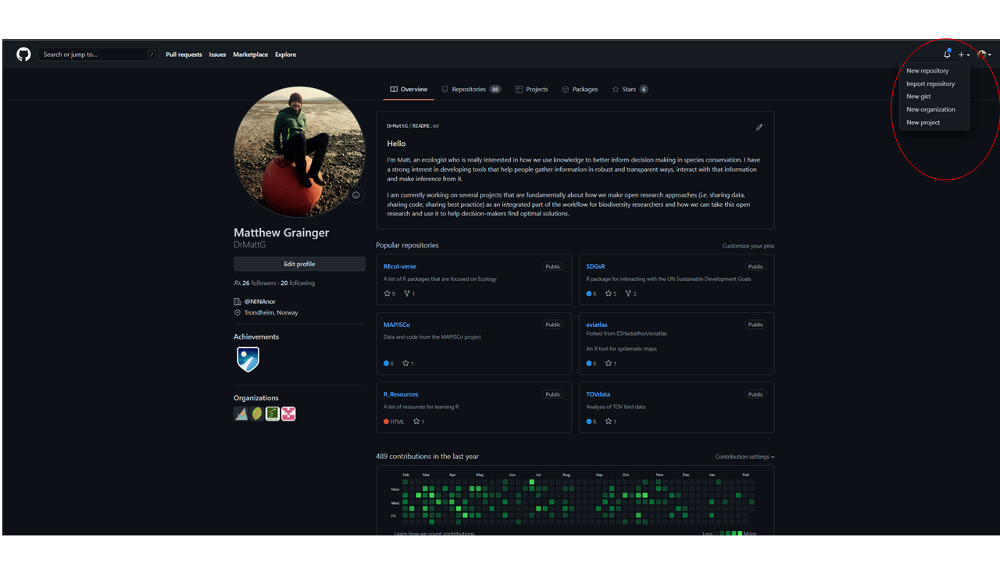
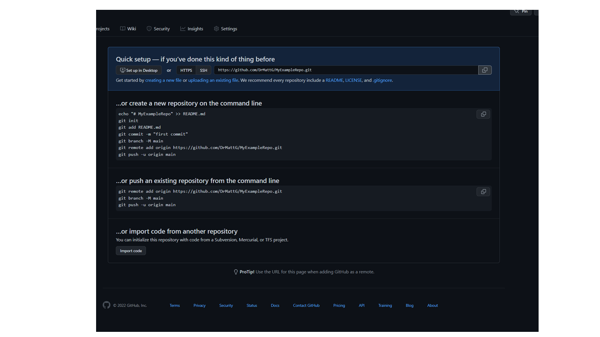
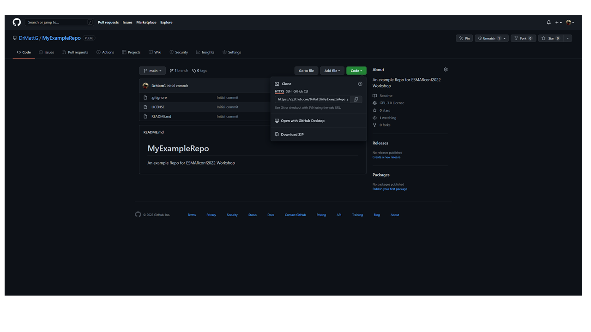

```{r setup, include=FALSE}
knitr::opts_chunk$set(echo = TRUE)
```


# What is Git and GitHub?

Git is an *opensource* *version control* system created by Linus Torvalds in 2005. It allows for tracking of changes in any set of files and was designed to facilitate collaborative coding for software development.   


GitHub is a Hub for Git! Recently GitHub has been acquired by Microsoft and there is some concerns that the openSource nature might be compromised in the future. There are other options - many developers are switching to Gitlab. 


GitHub (or GitLab) makes it a lot easier for users to interact with Git. **You do not need to be an expert to use GitHub**. 

# Why use Git and GitHub?

The most important reason for using Git/GitHub/GitLab etc. is *version control*. 

## Version control

Fundamentally *version control* is "track-changes" for code (and other files). Each change to specified files is logged and tracked over time, and all previous versions of the files are maintained. It is useful for yourself (your future self can see what you did in the past and why) and for collaborations. 


# When should you start using GitHub?

NOW! You can use GitHub as an individual (you "collaborate" with your future and past self on coding - sometimes you might not work on a project for many years - if you have version control you do not have to re-invent the wheel each time you pick up a project again). 


# How to use GitHub with RStudio?

One of the biggest barriers to using GitHub for me was understanding the "Shell" commands. With RStudio you can actually get quite far in to using GitHub without touching the shell. We will focus on using the Git commands that are inbuilt in RStudio for now.   


## My typical workflow 

*This is my typical workflow - it could be optimised in many ways but I am old and resistant to change*

### Initialise your own project in GitHub

We can initialise our own project on GitHub or we can make a local copy of someone else's project. Let's start by looking at setting up our own project on GitHub. 

* Step 1 - Go to your GitHub profile: [this is mine](https://github.com/DrMattG)
* Step 2 - Click on the + button on the top toolbar and then "New repository"



* Step 3 - Give your repository a name, a description, and add a README file (this helps people know what your project is about). You can also add a ".gitignore" file - you can use the R template which ignores some of the files that R automatically produces. Choosing a license is important (more about this later on)


* Step 4 - In RStudio you can create a new project by clicking on:
  File>>> New Project>>>
                        Version control>>>
                                          Git>>>
                                                Repository URL
                                                
                                                


                                                
We get the repository URL from GitHub - either from here:
  

  
Or from here:




### *Clone* a project from someone else

We can clone a project from someone else by going to their GitHub profile and using the *clone* button. For example:


A clone is a local version (on your computer) of someone elses' repository. 

A *fork* is a version of someone elses' repository on your GitHub profile.


Forking a repository means you can make your own adaptations to the code. 

# The next steps

Now that you have set up your repository you can start to actually write code, make changes and collaborate with others. In the next section we will begin to look at some of the ways we can do this. 


