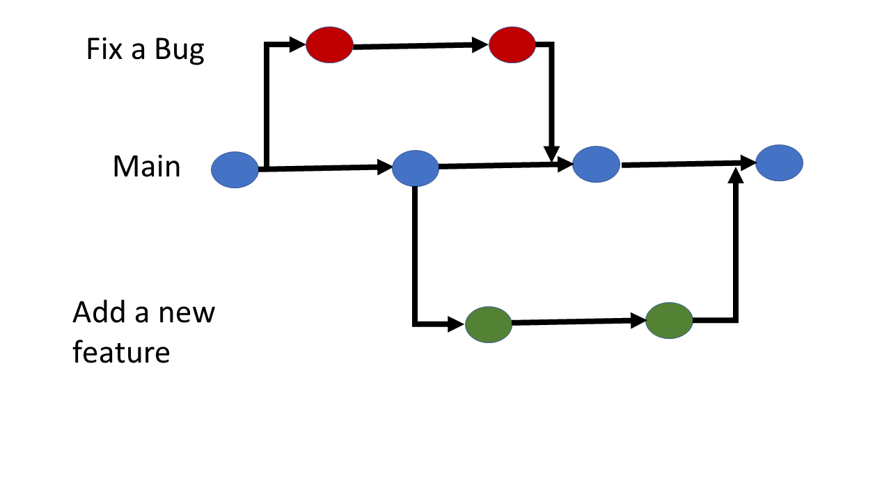
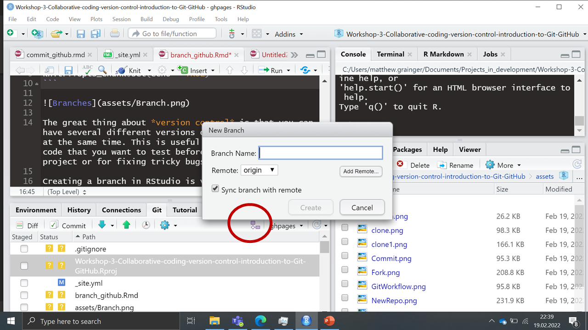

```{r setup, include=FALSE}
knitr::opts_chunk$set(echo = TRUE)
```



The great thing about *version control* is that you can have several different versions of the same project all at the same time. This is useful for developing new code that you want to test before adding it to the main project or for fixing tricky bugs. 

Creating a branch in RStudio is very easy - just click on the button in the Git tab and then name and create your branch.


